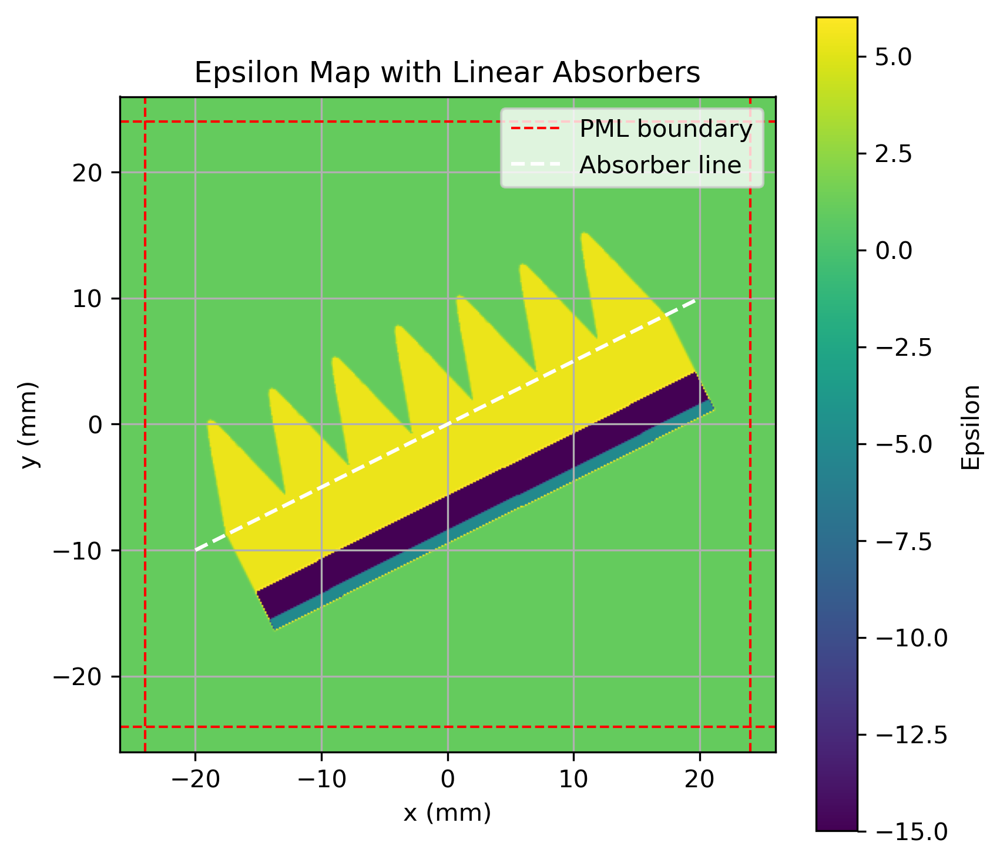
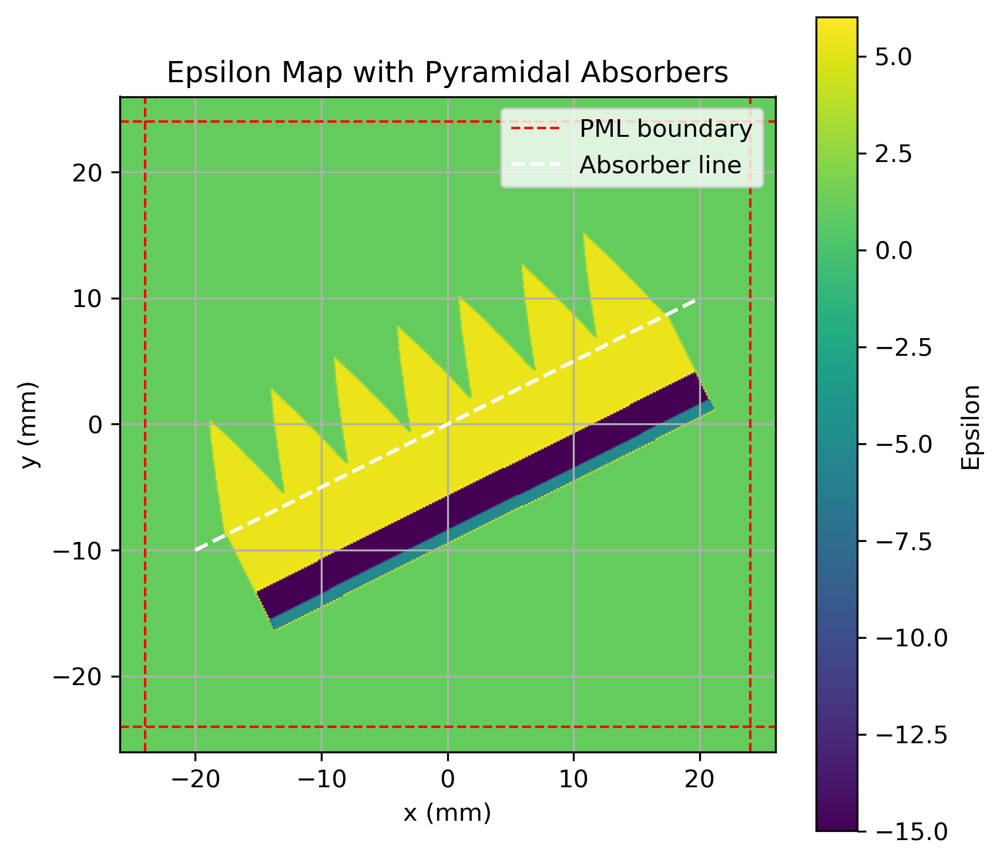

---
# Absorbers
---

[TOC]

## Introduction

Broadband Microwave Absorbers in CMB Telescopes helps in controlling stray light at millimeter wavelengths that requires special optical design and characterisation. In this section, we present the concepts and workflow used for creating different types of absorbers that can be used for various types of simulations (e.g., full telescope and unit cells simulations).

The concepts used here are mainly adopted from this [paper](https://arxiv.org/pdf/2511.05309). In the current version of MeepSAT, the following types of absorbers are supported:

- Pyramidal 
- Linear
- Exponential

Very soon, we will also implement other types of absorbers (Klopfenstein, Stepped) as well.


## Workflow

As described in this [paper](https://arxiv.org/pdf/2511.05309), we follow the following chain to define the different types of absorbers: 

$$\text{z(l)} \implies \epsilon\text{(l)} \implies \alpha\text{(l)} \implies \text{Required Geometry}$$

- $\text{z(l)}$ is the impedance profile of a particular taper
- $\epsilon\text{(l)}$ is the relative permittivity at l
- $\alpha\text{(l)}$ is the filling factor at l
- l varies from location 0 to h where h is the height of the taper.


Assuming p to be the base, h be the height of the absorber and $\theta$ be the angle of the absorber w.r.t normal axis. At l = 0, the impedance matches the impedance of the lossy dielectric, $Z_1 ≡ Z_0/\epsilon_r$ and $Z(h) = Z_0$ representing the impedance of the medium just outside the tip of the taper.

**Step 1: Choose the type of taper**

- Pyramidal

$$\alpha(l) = \left(\frac{p - 2\tan(\theta)l}{p}\right)^2$$

`Note`: We want to have one geometry such that it mimics the original or simple pyramid shape that usually all the absorbers have. Therefore [Singh et al.(2026)](https://arxiv.org/pdf/2511.05309) define it directly from the point of view of geometry and not impedance.

- Linear

$$Z_{\text{lin}}(l) = (\frac{Z_1 - Z_0}{h})l + Z_0$$

- Exponential

$$Z_{\text{exp}}(l) = Z_1 e^{\frac{l}{h}\ln{\frac{Z_0}{Z_1}}}$$

**Step 2: Calculate the relative permittivity at location l**

$$\epsilon(l) = (\frac{Z_0}{Z_l})^2$$

**Step 3: Calculate the filling factor $\alpha(l)$**

$$\alpha(l) = \sqrt{\frac{\epsilon(l) - 1}{\epsilon_r-1}}$$

**Final Step: Extracting the geometry**

The geometry of the absorber can then be constructed along the height h via

$$p^2 \alpha(l)$$

## Implementation in MeepSAT

The main function that deals with the Absorber generation is `Absorbers` in `meep_geometry.py`:

```python
class Absorbers:
    def __init__(self,
                 p,
                 taper_type,
                 grid_size_sx,
                 grid_size_sy,
                 resolution,
                 center_x_mm,
                 center_y_mm,
                 eps_array,
                 geometry_objects,
                 z0,
                 z1,
                 orientation,
                 angle_axis,
                 h= None,
                 p_h_ratio= None,
                 substrate_thickness=None,
                 substrate_material=None,
                 add_substrate = False,
                 mesh_filter_option='min',
                 epsilon_r=None,
                 epsilon_i=None,
                 material=None,
                 freq= None,
                 material_type='narrow_bandwidth_absorption',
                 start_point = None,
                 end_point = None,
                 overall_factor= 0.95,
                 plot_alpha=False,
                 plot_profile=False,
                 plot_mesh= False,
                 savepath=None
                 )
```


Class for generating the different types of absorbers explained above.

Key Parameters:

**Parameters defining Geometry**

+ **`p` [`float`]** — base width of absorber (mm).

+ **`h` [ `float` optional ]** — absorber height (mm).

+ **`p_h_ratio` [ `float` optional ]** — if provided, **`h`** is computed as **`h`** = **`p`** * **`p_h_ratio`**

+ **`taper_type` [ `str`]** — default is `"Pyramidal"`. Available options as of now `"Linear"` or `"Exponential"`

+ **`orientation` [`str` or `float`]** — Direction of absorber placement. Options: `"+x"`, `"-x"`, `"+y"`, `"-y"`, or an angle in degrees (`float`).

+ **`angle_axis` [`str`]** — Axis convention for angular orientation. Currently supports `"x"`. Note: `"y"`-axis orientation is not yet implemented.

**Parameters Defining Simulation Grid**

+ **`grid_size_sx` [`float`]** — Simulation domain size in x-direction (mm).

+ **`grid_size_sy` [`float`]** — Simulation domain size in y-direction (mm).

+ **`resolution` [`float`]** — Grid resolution (pixels per mm).

+ **`center_x_mm` [`float`]** — X-coordinate of absorber center (mm).

+ **`center_y_mm` [`float`]** — Y-coordinate of absorber center (mm).

+ **`eps_array` [`ndarray`]** — Base epsilon (permittivity) map as 2D numpy array.

+ **`geometry_objects` [`list`]** — Destination list for Meep geometry primitives.

**Parameters Defining Material Properties**

+ **`material` [`mp.Medium`, optional]** — Explicit Meep material object. If provided, overrides `epsilon_r` and `epsilon_i`.

+ **`epsilon_r` [`float`, optional]** — Relative permittivity (real part). Required if `material` is not provided.

+ **`epsilon_i` [`float`, optional]** — Imaginary permittivity (loss/conductivity term). Used with `epsilon_r` for lossy materials.

+ **`freq` [`float`, optional]** — Frequency value (Hz). Required when using narrow-bandwidth absorption material type with `epsilon_i`.

+ **`material_type` [`str`]** — Material model type. Default: `"narrow_bandwidth_absorption"`. Controls how loss is handled in frequency domain.

**Parameters Defining Impedance Profile**

+ **`z0` [`float`, optional]** — Impedance at base of absorber. Default: `1.0`.

+ **`z1` [`float`, optional]** — Impedance at tip of absorber. Default: `1.0 / sqrt(epsilon_r)`.

**Parameters Defining Substrate**

+ **`add_substrate` [`bool`]** — Enable substrate block generation. Default: `False`.

+ **`substrate_thickness` [`float` or `list[float]`, optional]** — Thickness of substrate layer(s) (mm). Can be single value or list for multilayer substrates.

+ **`substrate_material` [`mp.Medium` or `list[mp.Medium]`, optional]** — Material of substrate layer(s). If not provided, defaults to absorber material.

**Parameters for Multi-Placement**

+ **`start_point` [`tuple` or `list`, optional]** — Starting point (x, y) for placing multiple absorbers along a line (mm).

+ **`end_point` [`tuple` or `list`, optional]** — Ending point (x, y) for placing multiple absorbers along a line (mm).

+ **`overall_factor` [`float`]** — Spacing overlap control factor. Default: `0.95`. Values < `1.0` increase overlap between adjacent absorbers.

**Parameters for Meshing**

+ **`mesh_filter_option` [`str`]** — Triangular mesh filtering option. Default: `"min"`.

**Parameters for Plotting & Output**

+ **`plot_alpha` [`bool`]** — Plot filling factor (alpha) profile. Default: `False`.

+ **`plot_profile` [`bool`]** — Plot absorber width profile. Default: `False`.

+ **`plot_mesh` [`bool`]** — Plot triangular mesh. Default: `False`.

+ **`savepath` [`str`, optional]** — Directory for saving generated plots. Default: current directory (`"./"`)`.

### Unit Cell and Multiple Absorber

We will be using the same dimensions of the absorbers mentioned in [Singh et al.(2026)](https://arxiv.org/pdf/2511.05309). 

First we will import all the necssary packages

```python
import meep as mp
import numpy as np
import matplotlib.pyplot as plt
import meepsat.simulator as sim
import meepsat.meep_geometry as comp_meep
import math
```

Then we define the frequency, wavelength, and other parameters for testing

```python
real_freq = 90e9  # 90 GHz
wavelength = (3e8 / real_freq)*1e3 # Speed of light divided by frequency for wavelength in mm
frequency = 1 / wavelength  # Frequency in MEEP units (1/length)
resolution = 8 # 8 pixels per mm (generally it should be minimum 8*frequency)
```

Define the dummy simulation box size and source parameters for testing

```python
cell_size = mp.Vector3(50, 50, 0)  # Simulation box
source_center = mp.Vector3(0, 0, 0)  # Source center
source_size = mp.Vector3(1, 1, 0)    # Source size
boundary_layer_size = 2  # PML boundary layer size  
factor_dpml = 1  # PML thickness factor

```

Initialize the simulation with the different parameters and an epsilon map array which will then be used to draw the absorbers

```python
mpsat_sim = sim.sim_init(sim_name= "PyramidalAbsorbers Design Test",
                        cell_size= [cell_size[0], 
                                    cell_size[1],
                                    cell_size[2]], # [sx, sy, sz] in mm
                        smallest_freq= frequency, # in MEEP units (1/length)
                        resolution= resolution, # pixels per unit length (mm)
                        boundary_layer_type= 'PML',
                        boundary_layer_size= boundary_layer_size,
                        factor_dpml= factor_dpml)

eps_array = np.ones((int(cell_size.x*mpsat_sim.resolution), int(cell_size.y*mpsat_sim.resolution)), dtype=complex)
```

Now let's define the absorbers. As stated in [Singh et al.(2026)](https://arxiv.org/pdf/2511.05309), we will be using the base to be 6 mm and the ratio of base to height to be 1.5. For this specific example, we are going to use a Linear taper type absorber, with starting and ending points to be (-20, -10) to (20, 10) respectively. The material of the Absorber is set to be `material_type = narrow_bandwidth_absorption`, that means we first calculate the conductivity as `D_conductivity = (epsilon_i * 2 * math.pi * freq) / epsilon_r` and set the material to be `material = mp.Medium(epsilon=epsilon_r, D_conductivity=D_conductivity)`. For more details visit this [MEEP Documentation](https://meep.readthedocs.io/en/latest/Materials/#conductivity-and-complex) page. We are using three layers of substrate with the following parameters:

```python
substrate_thickness=[5, 2.5, 1] # Thickness of the thickness of the absorber in mm
substrate_material=[None, # Means its the same material type as that of the Absorber
                    mp.perfect_electric_conductor,
                    mp.Medium(epsilon=-5)]
```

Now let's extract the geometry of the absorbers

```python
absorbers = comp_meep.Absorbers(
    # Absorber Dimensions:
    p=6,
    p_h_ratio=1.5,
    taper_type='Linear',
    grid_size_sx=mpsat_sim.cell_size[0],
    grid_size_sy=mpsat_sim.cell_size[1],
    resolution=mpsat_sim.resolution,
    eps_array=eps_array,
    geometry_objects=[],
    # Impedance Parameters:
    z0=1,
    z1=1/math.sqrt(5.4),
    # Centre, Angle and orientation Parameters; 
    # They don't work if start and end points are given
    center_x_mm=10,
    center_y_mm=10,
    orientation='-y',
    angle_axis="x",
    # Substrate parameters
    substrate_thickness=[5, 2.5, 1],
    substrate_material=[None,#mp.Medium(epsilon=-5.0), # means use the absorber material as substrate
                        mp.perfect_electric_conductor,
                        mp.Medium(epsilon=-5)],
    add_substrate = True,
    # Absorber Material parameters
    epsilon_r=5.4,
    epsilon_i=0.8,
    # material=None,
    material_type = 'narrow_bandwidth_absorption',
    freq=frequency,
    # Placing absorbers between two points in a straight line
    start_point=(-20, -10),
    end_point=(20, 10),
    overall_factor = 1,
    plot_alpha=True,
    plot_profile=True,
    savepath='./output_files/',
    plot_mesh = True
)

mpsat_sim.meep_geometry.extend(absorbers.assemble())
```
`Note:` The `center_x_mm`, `center_y_mm`, `orientation` and `angle_axis` parameters gets overide by the `start_point` and `end_point` parameters.

Let's run the simulation for 0 timestep and see whether we get the expected Absorber design or not

```python
simulation = mp.Simulation(
    cell_size=mpsat_sim.cell,
    sources= [],
    resolution=mpsat_sim.resolution,
    boundary_layers= [mp.PML(thickness= mpsat_sim.factor_dpml*mpsat_sim.dpml)],
    geometry= mpsat_sim.meep_geometry,
    force_complex_fields= True,
    split_chunks_evenly = False)

# Run the simulation and extract the epsilon map
# Run simulation briefly to get epsilon
simulation.run(until=0)
epsilon = simulation.get_epsilon()

# Plot the epsilon map to visualize the forebaffle
fig, ax = plt.subplots(figsize=(6, 6))
im = ax.imshow(epsilon.T, origin='lower', extent=(-simulation.cell_size.x/2, simulation.cell_size.x/2, -simulation.cell_size.y/2, simulation.cell_size.y/2),
               cmap='viridis', vmin=-15, vmax=6)
# Draw PML boundary layers
pml_thickness = mpsat_sim.factor_dpml * mpsat_sim.dpml
ax.axvline(x=-simulation.cell_size.x/2 + pml_thickness, color='red', linestyle='--', linewidth=1, label='PML boundary')
ax.axvline(x=simulation.cell_size.x/2 - pml_thickness, color='red', linestyle='--', linewidth=1)
ax.axhline(y=-simulation.cell_size.y/2 + pml_thickness, color='red', linestyle='--', linewidth=1)
ax.axhline(y=simulation.cell_size.y/2 - pml_thickness, color='red', linestyle='--', linewidth=1)
ax.legend(loc='upper right')

plt.colorbar(im, ax=ax, label='Epsilon')
ax.set_title('Epsilon Map with Absorbers')
ax.set_xlabel('x (mm)')
ax.set_ylabel('y (mm)')
ax.grid()

# Save as h5py for further analysis
import h5py
with h5py.File('epsilon_map_pyramidal_absorbers.h5', 'w') as f:
    f.create_dataset('epsilon', data=epsilon)

# Also save as PNG for quick viewing
plt.savefig('./output_files/epsilon_map_pyramidal_absorbers.png', dpi=300, bbox_inches='tight')

# Close the figure
plt.close(fig)
```
Here's the resulting epsilon map



Now if we change `taper_type = Pyramidal` or `taper_type = Exponential`




Now if you want to construct a single absorber (for debugging OR simulations with periodic conditions), you can just remove the `start_point` and `end_point` parameters

