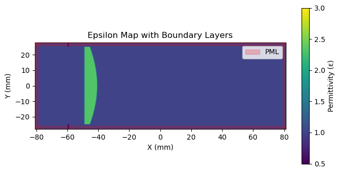
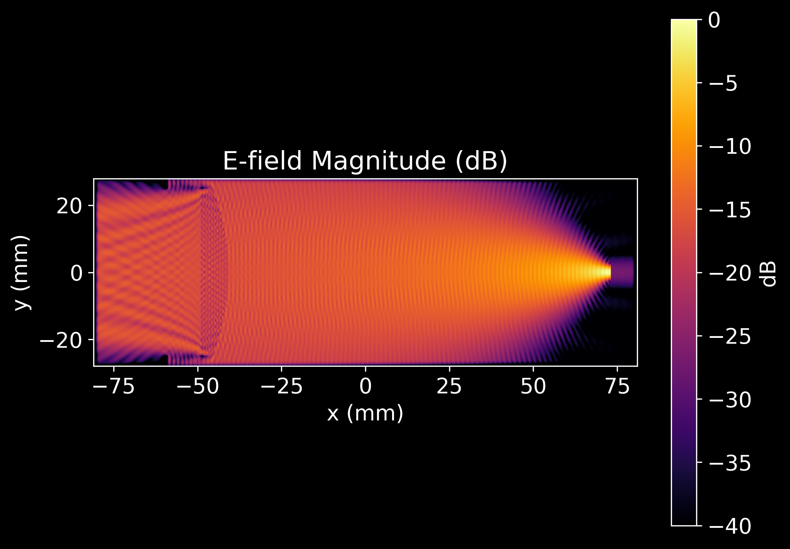
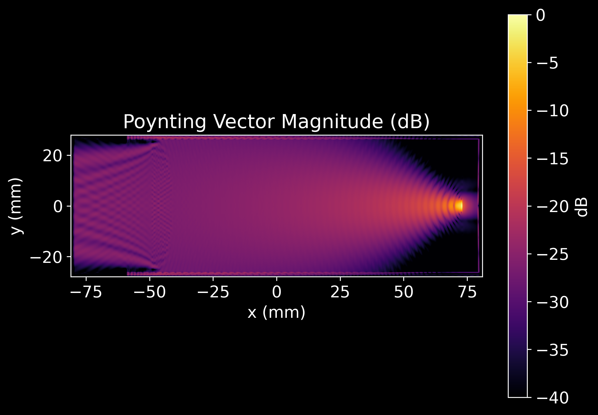
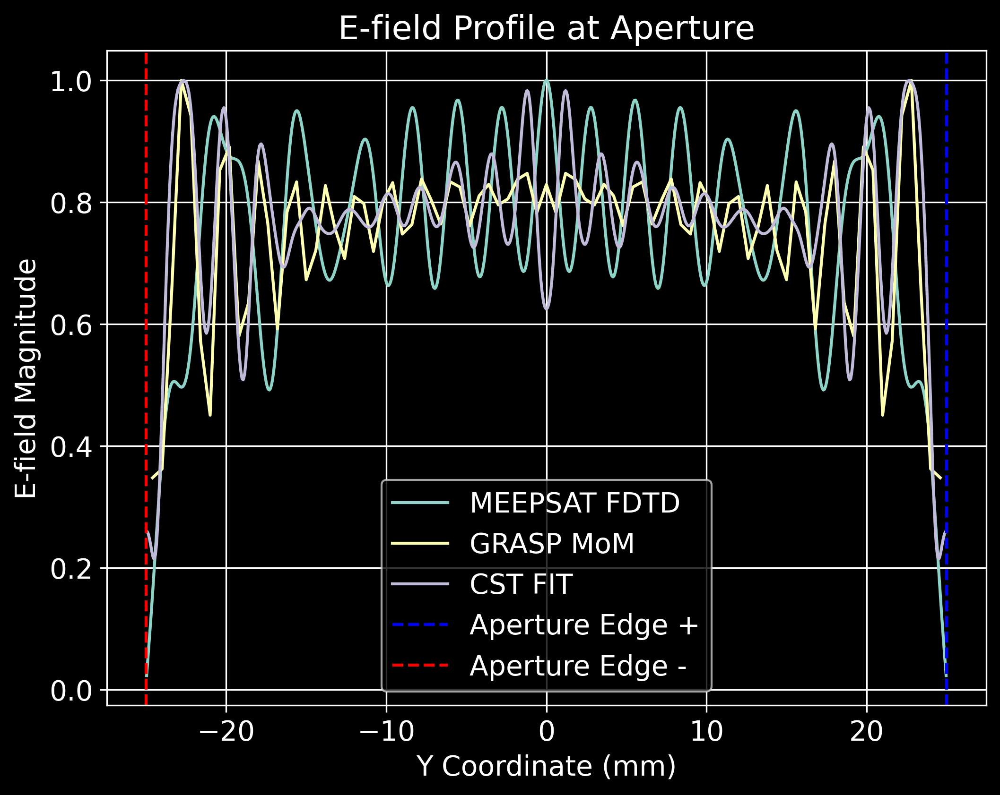
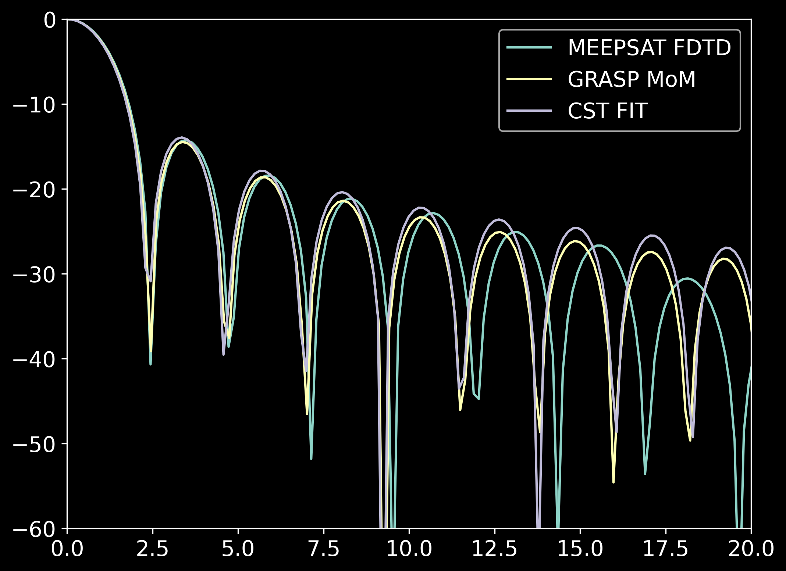

# Simple Single Lens (with ARC)

[TOC]

The code used in this tutorial can be found at [Single_lens_system.ipynb](https://github.com/aa16oaslak/MeepSAT/blob/main/examples/simple_single_lens_ARC.ipynb)

`NOTE`: First, make sure to connect to the correctly installed version of MeepSAT's jupyter kernel 

In this tutorial, we will simulate a 2D Gaussian beam propagating through a plano-convex lens with anti-reflective (AR) coatings. By the end of this tutorial, you will understand how to:

- Configure simulation parameters in JSON format
- Defining a monochromatic source
- Define simple optical components like lenses and apertures
- Visualize and analyze the electromagnetic field evolution over time.


Let's import the various Python libraries and MeepSAT modules

```python
import sys
import os
import site
from pathlib import Path
import meep as mp
import numpy as np
import h5py
import matplotlib.pyplot as plt
import time
import json

# Importing the MEEPSAT librarires
import meepsat.simulator as sim
import meepsat.meep_geometry as comp_meep
import meepsat.permittivity_components as comp_eps
import meepsat.stepfunctions as stepfunctions
import meepsat.json_to_script as json_to_script
import meepsat.field_analysis as mpsat_analysis
import meepsat.helpers as mpsat_helpers

# JSON file path representing mainly the different optical components parameters
json_file_path = 'auxilary_data/simple_single_lens_ARC/simple_single_lens_ARC.json'
data = mpsat_helpers.read_json(json_file_path)

# Savepath: For storing the output generated during the simulation
savepath = 'auxilary_data/simple_single_lens_ARC/output_files'
os.makedirs(savepath, exist_ok=True)
```

Let's initialise the MeepSAT simulation object from the parameters stored in the JSON file

```python
# Initialising MEEPSAT Simulation
cell_X, cell_Y, cell_Z = data["simulation"]['primary_params']['cell_size']['x'], data["simulation"]['primary_params']['cell_size']['y'], data["simulation"]['primary_params']['cell_size']['z'] # Cell Size without considering the PML thickness and its factor


# Initialize the simulation with the different parameters
mpsat_sim = sim.sim_init(sim_name= str(data["simulation"]["name"]),
                        cell_size= [cell_X, cell_Y, cell_Z], # [sx, sy, sz] in mm
                        smallest_freq= data["simulation"]['primary_params']['smallest_freq'], 
                        resolution= data["simulation"]['primary_params']['resolution'],
                        boundary_layer_type= data['boundary_layers']['boundary']['type'],
                        boundary_layer_size= data['boundary_layers']['boundary']['size'],
                        factor_dpml= data['boundary_layers']['boundary']['factor_dpml'])
```

Before creating the components, its very important to check if the mentioned resulution and PML boundary layer thickness is enough for our simulation OR not. In Meep FDTD, its recommended to have atleast 8-10 pixels for the smallest wavelength OR length scale present in your system. 

You can check the resolution and verify using `sim.check_resolution_and_pml`. For more on resolution, you can check [MEEPs documentation page](https://meep.readthedocs.io/en/latest/Python_Tutorials/Basics/#a-straight-waveguide).

```python
# Checking resolution and PML thickness 
# This function will automatically check all the length scales and wavelength scales
data, mpsat_sim = sim.check_resolution_and_pml(
    data=data, 
    mpsat_sim=mpsat_sim,
    smallest_freq=data["simulation"]['primary_params']['smallest_freq'],
    highest_n=data["lenses"]["lens1"]["n_refr"]
)

# Print the simulation parameters
print("\nMEEPSAT SIMULATION PARAMETERS:")
mpsat_sim.print_simulation_parameters()
```

Now let's add a Monochromatic Source. You can do this via: You can either follow the Source documentation mentioned in the [Source](../FEATURES/Source.md) documentation. documentation page OR just use MeepSAT's built-in function to generate the source from the JSON file. Here we will be following the later case.

```python
source_list = []
exec(json_to_script.source_script(data))
```

Adding PML boundaries using MEEPs default functions
```python
x_left_boundary = mp.PML(thickness=mpsat_sim.dpml*mpsat_sim.factor_dpml, direction=mp.X, side=mp.Low)
x_right_boundary = mp.PML(thickness=mpsat_sim.dpml*mpsat_sim.factor_dpml, direction=mp.X, side=mp.High)
y_down_boundary = mp.PML(thickness=mpsat_sim.dpml*mpsat_sim.factor_dpml, direction=mp.Y, side=mp.Low)
y_up_boundary = mp.PML(thickness=mpsat_sim.dpml*mpsat_sim.factor_dpml, direction=mp.Y, side=mp.High)

custom_boundary_layers = [x_left_boundary, x_right_boundary, y_down_boundary, y_up_boundary]
```
Now as we need to add a lot of complex structures (lenses, absorbers etc), we will define a empty epsilon map for this purpose. Its basically a 2D spatial discretization array of the simulation domain and the idea is to draw structure on this 2D array

```python
size_x, size_y, size_z = mpsat_sim.cell_size[0], mpsat_sim.cell_size[1], mpsat_sim.cell_size[2]
res = int(mpsat_sim.resolution)  # Ensure resolution is an integer
# Create the epsilon map: total size of the simulation cell in all the axis multiplied by the resolution + 1
epsilon_map = np.ones((int((size_x)*res+1), 
                       int((size_y)*res+1)), dtype = 'float32')
```

Now as we did for the Source, we will use MeepSAT built in function for defining lenses and aperture

```python
# Adding lens (if given)
exec(json_to_script.add_lens(data))

# Adding aperture (if given)
exec(json_to_script.add_aperture(data))
```

Since this system is system at x=0 plane, we will use MEEP's Mirror symmetry functionality.

```python
symmetries = [mp.Mirror(mp.Y, phase=+1)] 
```

Now defining the Meep Simulation Object

```python
simulation = mp.Simulation(
    cell_size=mpsat_sim.cell,
    sources=source_list,
    resolution=mpsat_sim.resolution,
    boundary_layers=custom_boundary_layers,
    geometry=mpsat_sim.meep_geometry,
    epsilon_input_file = data["output"]["savepath"]["path"] + data["output"]["epsilon_h5_file"]["filename"] +"_epsilon_map" + ".h5",
    symmetries = symmetries,
    force_complex_fields= True)

simulation.use_output_directory(savepath)
```

Let's run the simulation briefly to store the epsilon map and visualise the permittivity map

```python
sim.plot_and_save_epsilon(
    simulation=simulation,
    savepath=savepath,
    filename_prefix="geometry_plot",
    epsilon_data_name="epsilon",
    size_x=size_x,
    size_y=size_y,
    vmin=0.5,
    vmax=3,
    cmap='viridis',
    figsize=(8, 4),
    dpi=300,
    show_plot= True
)
```

Here's the resulting epsilon map




Now let's set the different run time parameters:

- Animation
    `stepfunctions.set_animation_params(...)`
    - Configures how the simulation will be visualized as an animation
        - `image_every`: Frequency of field snapshots (e.g., every N timesteps)
        - `Nfps`: Frames per second for the output video
        - `anim_file_name`: Output path and filename for the MP4 movie

- Field Parameters
    `stepfunctions.set_field_params(...)`
    - Defines spatial and storage parameters for electromagnetic field data
        - `size_x`, `size_y`: Physical dimensions of the simulation domain
        - `savepath`: Directory where field data will be stored
        - `downsampling_factor_x/y`: Reduces data resolution for storage (e.g., keep every Nth point)

- Runtime Parameters
    `runtime_params = sim.calculate_runtime_parameters(...)`
    - Computes temporal simulation parameters for field extraction based on the source frequency
        - `source_freq`: Operating frequency (extracted from JSON with a typo "frequecy")
        - `total_time`: Total simulation duration
        - `animation_timestep`: Time interval between field captures
        - `points_per_period`: Temporal resolution (10 points per wavelength period)
        - `extraction_offset`: Buffer time before field extraction begins

Now let's run the simulation by setting the above parameters

```python
# Set the stepfunctions parameters
# Animation Parameters
stepfunctions.set_animation_params(anim_params= {'image_every': data["output"]["animation_options"]["image_every"], 
                                              'Nfps': data["output"]["animation_options"]["Nfps"], 
                                              'anim_file_name': savepath + "/"+ data["output"]["animation_options"]["movie_name"] + ".mp4"})
# Field Parameters
stepfunctions.set_field_params(field_params= {'size_x': size_x,
                                              'size_y': size_y,
                                              'savepath': savepath,
                                              'downsampling_factor_x': data["output"]["animation_options"]["downsample_x"],
                                              'downsampling_factor_y': data["output"]["animation_options"]["downsample_y"]})

# Runtime parameters
runtime_params = sim.calculate_runtime_parameters(
    source_freq=float(data["sources"]["source1"]["frequecy"]),
    total_time= 400,
    animation_timestep = data["output"]["animation_options"]["image_every"],
    points_per_period=20,
    extraction_offset=10
)

simulation.run(mp.at_every(runtime_params["animation_timestep"], stepfunctions.Ez2_dB),
               mp.after_time(runtime_params["t0"], mp.at_every(runtime_params["dt"], stepfunctions.accumulate_efield_and_hfield)),
               mp.at_end(stepfunctions.save_animation),
               mp.at_end(stepfunctions.save_accumulated_fields),
               mp.at_end(stepfunctions.extract_xyzw),
               until = runtime_params["total_time"])

print("Simulation completed.")                                                 

# #~ ---------------------------------------------

# Save the final edited JSON data
with open(data["output"]["savepath"]["path"] + data["simulation"]["name"] + "_simulation_data.json", "w") as f:
    json.dump(data, f, indent=2)
print(f"Simulation parameters saved to: {data['output']['savepath']['path']}{data['simulation']['name']}_simulation_data.json")
```

# Post Simulation Analysis

Now we will be extracting the following information from the post-processed data:

- Verifying the aperture profile and the corresponding far field beams with industry standard softwares such as CST and GRASP.
- Calculating the poynting vector $\textbf{S}$ from the $\textbf{E}$ and $\textbf{H}$ fields.
- Analysing the Scalar Product between the Poynting Vector components of time-forward and time-reverse simulations.


The Poynting vector components in TE mode are:

- $S_x = -E_z \cdot H_y^*$

- $S_y = E_z \cdot H_x^*$

At 150 GHz, we get the following E-field and S-field maps:





## Far Field Beam comparision with CST and GRASP

In the current version of the MeepSAT, we extract the Far Field Beam profile using the [Fraunhofer diffraction](https://en.wikipedia.org/wiki/Fraunhofer_diffraction_equation) formula, where the far field is basically the fourier transform of the fields at the aperture. In the near future, we will also have the capabilties in MeepSAT to extract the far field beam using the spherical decomposition approach. Here are the efield amplitude profiles compared with GRASP Method-of-Moments and CST Finite Integration Time methods





After confirming that MeepSAT agrees well with pre-established industry standard softwares such as CST and GRASP, we move forward in testing it for the existing 2-lens system design for SPIDER 2.
